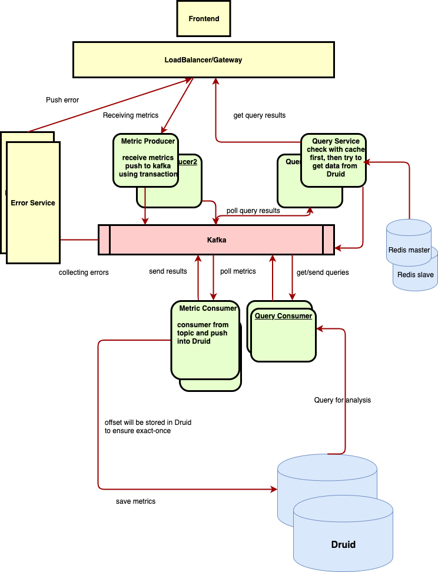

# Google Analytics Backend

## components
*Load Balancer and Gateway
>* dispatch the requests and load balancing

* Metric Producer:
> * received the metrics and push them into kafka topic using kafka transaction
> * config transaction operation for kafka producer
> * store no information in memory to make it easy to scale to cope with massive requests
> * error message will be sent to error topic in Kafka

* Kafka:
> * could handle massive write and read requests
> * decoupling the read and write ops
> * smooth the request to avoid spike

* Metric Consumer:
> * received the metrics by listening to topic and sink them to Druid using KStreams
> * stateless, read offsets will be stored in RocksDB
> * error message will be sent to error topic in Kafka

* Query Consumer:
> * Query data from Druid by received by listening to topic, sending results to another topic
> * error message will be sent to error topic in Kafka
> * stateless

* Query Service:
> * listening tp the topic the query consumer sends messages to
> * save the cache in the redis using cache-aside pattern
> * stateless

* Error Service:
> * listening tp the topic of error messages
> * sending notification to frontend(keep-alive connection)

## Problems and Answers
Q: handle large write volume: Billions write events per day.
* A: All components could be horizontal scaling, so it is easy to cope with the request
Kafka and Redis could hold 10W+ QPS, so there is no bottleneck

Q: handle large read/query volume: Millions merchants want to get insight about their business. Read/Query patterns are time-series related metrics.
* A: Query service / consumer are horizontal scalable, with kafka streams / Druid, it could be in nearly real-time

Q: provide metrics to customers with at most one hour delay.
* A: Almost real-time, since Kafka message transmission is fast and Druid has the pre-aggregation before persistence, so Druid is fast enough
Q:run with minimum downtime.
* A: all components have multiple instances, suppose we could deploy them in kubernetes cluster to leverage its HA features (Service / liveness & readiness probe /rolliing update)

Q:have the ability to reprocess historical data in case of bugs in the processing logic.
* A: with Extra-Once configured in the KafkaStreams, data could be reprocessed if anything error happens.
